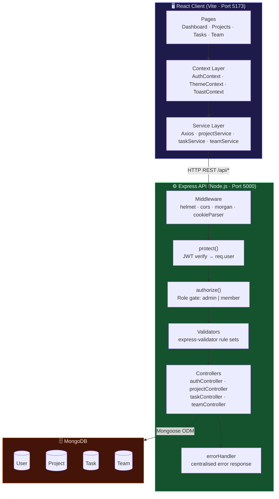
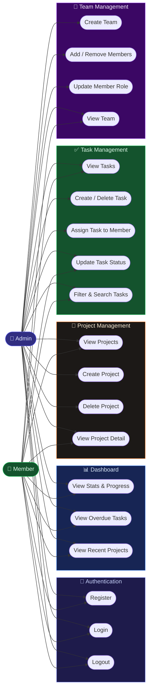

# ⚡ TaskFlow — Team Task Manager

> A full-stack MERN web application for managing projects, assigning tasks, and tracking team progress — with role-based access control (Admin / Member).

[](https://nodejs.org)
[](https://react.dev)
[](https://www.mongodb.com)
[](https://expressjs.com)
[](LICENSE)

---

## 📌 Table of Contents

- [Overview](#overview)
- [System Architecture](#system-architecture)
- [Use-Case Diagram](#use-case-diagram)
- [Features](#features)
- [Tech Stack](#tech-stack)
- [Project Structure](#project-structure)
- [Getting Started](#getting-started)
- [Environment Variables](#environment-variables)
- [API Reference](#api-reference)
- [Role-Based Access Control](#role-based-access-control)
- [Seeding Demo Data](#seeding-demo-data)
- [Deployment (Railway)](#deployment-railway)
- [Screenshots](#screenshots)

---

## Overview

**TaskFlow** is a production-ready team productivity app built with the **MERN stack**. It lets Admins create projects, build teams, assign tasks to members, and track progress in real time. Members can log in and update the status of tasks assigned to them. A live dashboard gives both roles a snapshot of their workload, deadlines, and overdue items.

---

## System Architecture



---

## Use-Case Diagram



---

## Features

### 🔐 Authentication
- JWT-based auth stored in **httpOnly cookies** (XSS-safe)
- Bearer token support as fallback
- Signup & Login with full validation
- Password hashing with **bcryptjs** (12 salt rounds)
- Role selection at registration (Admin / Member)

### 📊 Dashboard
- Stat cards: **Total**, **In Progress**, **Completed**, **Overdue** tasks
- Segmented progress bar across all task statuses
- Live **Overdue Tasks** feed with priority badges
- **Recent Projects** grid with mini progress bars

### 📁 Projects
- Admins: Create, edit, delete projects
- Assign a project to a **Team** and set a **Deadline** and **Color**
- Members: View projects from teams they belong to
- Per-project task count breakdown (todo / in-progress / review / completed)

### ✅ Tasks
- Full task lifecycle: `todo → in-progress → review → completed`
- Priority levels: `low`, `medium`, `high`, `urgent`
- Due date tracking with **overdue detection** (virtual field + aggregation)
- Tags support
- Search & filter by status, priority, project, assignee
- Admins: Create, assign, edit, delete any task
- Members: Update **status only** on tasks assigned to them

### 👥 Team Management
- Admins create teams and invite members
- Per-team role management (`admin` / `member`)
- Owner is automatically added as team admin
- Add / remove members from teams

### 🎨 UI & UX
- **Dark & Light mode** toggle (persisted via `ThemeContext`)
- Glassmorphism-style sidebar with collapsible navigation
- Lucide React icons throughout
- Smooth `fade-in` page animations
- Responsive modal forms for create/edit actions
- Toast notifications for all user actions

---

## Tech Stack

| Layer | Technology |
|---|---|
| **Frontend** | React 19, React Router v7, Lucide React, Axios |
| **Backend** | Node.js, Express 4, Mongoose, JWT, bcryptjs |
| **Database** | MongoDB (local or Atlas) |
| **Validation** | express-validator |
| **Security** | Helmet, CORS, httpOnly cookie auth |
| **Dev Tools** | Vite, node --watch, concurrently |

---

## Project Structure

```
team-task-manager/
├── server/                     # Express API
│   ├── controllers/            # Route handlers
│   │   ├── authController.js
│   │   ├── projectController.js
│   │   ├── taskController.js
│   │   └── teamController.js
│   ├── middleware/
│   │   ├── auth.js             # JWT protect middleware
│   │   ├── rbac.js             # Role-based access (authorize)
│   │   ├── errorHandler.js
│   │   └── validate.js
│   ├── models/
│   │   ├── User.js             # Role: admin | member
│   │   ├── Project.js          # owner, team, deadline, color
│   │   ├── Task.js             # assignee, status, priority, dueDate
│   │   └── Team.js             # members with per-team roles
│   ├── routes/
│   │   ├── authRoutes.js       # /api/auth
│   │   ├── projectRoutes.js    # /api/projects
│   │   ├── taskRoutes.js       # /api/tasks
│   │   └── teamRoutes.js       # /api/teams
│   ├── validators/             # express-validator rule sets
│   ├── utils/                  # ApiError, generateToken
│   ├── seed.js                 # Demo data seeder
│   ├── app.js                  # Express app setup
│   └── server.js               # MongoDB connect + listen
│
├── client/                     # React (Vite) frontend
│   └── src/
│       ├── components/
│       │   └── Layout/         # Sidebar, Header, Layout wrapper
│       ├── context/
│       │   ├── AuthContext.jsx  # Global auth state
│       │   ├── ThemeContext.jsx # Dark/Light mode
│       │   └── ToastContext.jsx # Notification system
│       ├── pages/
│       │   ├── DashboardPage.jsx
│       │   ├── ProjectsPage.jsx
│       │   ├── ProjectDetailPage.jsx
│       │   ├── TasksPage.jsx
│       │   ├── TeamPage.jsx
│       │   ├── LoginPage.jsx
│       │   └── RegisterPage.jsx
│       ├── services/           # Axios API service layer
│       │   ├── api.js          # Axios instance (base URL, interceptors)
│       │   ├── projectService.js
│       │   ├── taskService.js
│       │   └── teamService.js
│       └── App.jsx             # Routes definition
│
├── .env.example                # Environment variable template
├── package.json                # Root: dev/build/start scripts
└── README.md
```

---

## Getting Started

### Prerequisites

- **Node.js** v18 or higher
- **MongoDB** running locally (`mongodb://localhost:27017`) **or** a MongoDB Atlas URI

### 1. Clone the repository

```bash
git clone https://github.com/YOUR_USERNAME/team-task-manager.git
cd team-task-manager
```

### 2. Install all dependencies

```bash
npm run install-all
```

This installs root, server, and client dependencies in one command.

### 3. Configure environment variables

```bash
cp .env.example .env
```

Open `.env` and fill in your values (see [Environment Variables](#environment-variables) below).

### 4. Seed demo data (optional but recommended)

```bash
cd server
node seed.js
```

This creates sample admin/member accounts, projects, teams, and tasks so you can explore the app immediately.

### 5. Start the development servers

```bash
# From project root — starts both server (port 5000) and client (port 5173) concurrently
npm run dev
```

Or start them separately:

```bash
npm run server   # Express API on http://localhost:5000
npm run client   # React (Vite) on http://localhost:5173
```

Open **http://localhost:5173** in your browser.

---

## Environment Variables

Create a `.env` file in the **project root**:

```env
# MongoDB connection URI
MONGO_URI=mongodb://localhost:27017/team-task-manager

# JWT secret — use a long random string in production
JWT_SECRET=your_super_secret_key_change_this

# Token expiry
JWT_EXPIRE=24h

# Environment
NODE_ENV=development

# Port for the Express server
PORT=5000

# Frontend URL (for CORS)
CLIENT_URL=http://localhost:5173
```

> **For production (Railway):** Set `NODE_ENV=production` and use your MongoDB Atlas URI for `MONGO_URI`. The client URL will be your Railway app URL.

---

## API Reference

All endpoints are prefixed with `/api`.

### Auth — `/api/auth`

| Method | Endpoint | Access | Description |
|---|---|---|---|
| POST | `/register` | Public | Register a new user |
| POST | `/login` | Public | Login and receive JWT cookie |
| GET | `/me` | Private | Get current user profile |
| POST | `/logout` | Private | Clear auth cookie |

### Projects — `/api/projects`

| Method | Endpoint | Access | Description |
|---|---|---|---|
| GET | `/` | Private | List all projects (role-scoped) |
| POST | `/` | Admin | Create a new project |
| GET | `/:id` | Private | Get project details + tasks |
| PUT | `/:id` | Admin | Update a project |
| DELETE | `/:id` | Admin | Delete project + all its tasks |

### Tasks — `/api/tasks`

| Method | Endpoint | Access | Description |
|---|---|---|---|
| GET | `/stats` | Private | Get task count stats (by status, priority) |
| GET | `/overdue` | Private | Get overdue tasks (role-scoped) |
| GET | `/` | Private | List tasks (with filters: status, priority, project, assignee, search) |
| POST | `/` | Admin | Create a new task |
| GET | `/:id` | Private | Get single task |
| PUT | `/:id` | Private | Update task (Members: status only, Admins: all fields) |
| DELETE | `/:id` | Admin | Delete a task |

### Teams — `/api/teams`

| Method | Endpoint | Access | Description |
|---|---|---|---|
| GET | `/` | Private | List all teams |
| POST | `/` | Admin | Create a new team |
| GET | `/:id` | Private | Get team details |
| PUT | `/:id` | Admin | Update team info |
| POST | `/:id/members` | Admin | Add a member to team |
| DELETE | `/:id/members/:userId` | Admin | Remove a member from team |
| PUT | `/:id/members/:userId/role` | Admin | Update a member's role |

---

## Role-Based Access Control

The app enforces two roles at both the API and UI levels:

| Action | Admin | Member |
|---|---|---|
| Register / Login | ✅ | ✅ |
| View Dashboard | ✅ | ✅ |
| View Projects | ✅ (own) | ✅ (team-joined) |
| Create / Delete Projects | ✅ | ❌ |
| View Tasks | ✅ (all project tasks) | ✅ (assigned only) |
| Create / Delete Tasks | ✅ | ❌ |
| Update Task Status | ✅ | ✅ (own tasks only) |
| Update All Task Fields | ✅ | ❌ |
| Manage Teams | ✅ | ❌ |
| View Overdue Tasks | ✅ | ✅ (scoped) |

Implemented via:
- **`middleware/auth.js`** — `protect()` verifies JWT on every protected route
- **`middleware/rbac.js`** — `authorize('admin')` blocks non-admin requests with HTTP 403

---

## Seeding Demo Data

Run the seed script to populate the database with realistic sample data:

```bash
cd server
node seed.js
```

**Demo credentials created:**

| Role | Email | Password |
|---|---|---|
| Admin | `admin@taskflow.com` | `password123` |
| Member | `alice@taskflow.com` | `password123` |
| Member | `bob@taskflow.com` | `password123` |

The seed creates 3 projects, 2 teams, and 15+ tasks across different statuses and priorities.

---

## Deployment (Railway)

The project is configured for a **single-service Railway deployment** — the Express server serves the React build in production.

### Steps

**1. Build the React client**
```bash
npm run build
```
This outputs to `client/dist/`, which Express serves in production mode.

**2. Push to GitHub**
```bash
git add .
git commit -m "ready for deployment"
git push origin main
```

**3. Create a Railway project**
- Go to [railway.app](https://railway.app) → **New Project** → **Deploy from GitHub repo**
- Select your repository

**4. Add environment variables in Railway**

Set the following in Railway's **Variables** tab:
```
MONGO_URI=mongodb+srv://<user>:<password>@cluster.mongodb.net/team-task-manager
JWT_SECRET=<your_production_secret>
JWT_EXPIRE=24h
NODE_ENV=production
PORT=5000
CLIENT_URL=https://<your-railway-app>.up.railway.app
```

**5. Set the start command** (Railway auto-detects `npm start`):
```
npm start
```
This runs `cd server && node server.js`, which connects to MongoDB and starts Express serving the built React app.

**6. Done** — Your app will be live at the Railway-provided URL.

---

## Screenshots

> *(Add screenshots here after deployment)*

| Page | Description |
|---|---|
| Dashboard | Stat cards, task progress chart, overdue list |
| Projects | Project table with status badges and progress bars |
| Tasks | Filterable task list with priority and status tags |
| Team | Member management with role badges |
| Login / Register | Auth forms with dark/light mode |

---

## License

This project is licensed under the **MIT License**.

---

<p align="center">Built with ❤️ using the MERN Stack</p>
