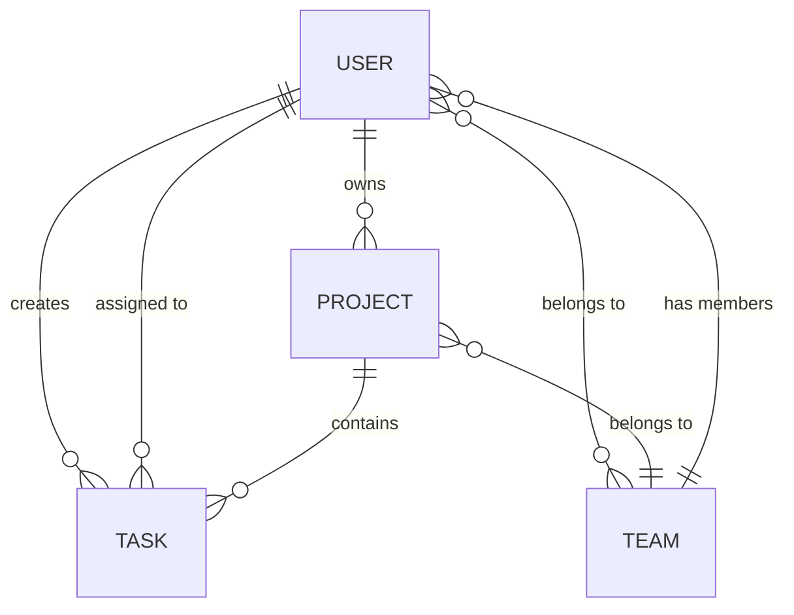

# Team Task Manager — Full-Stack Implementation Plan

Build a full-stack web app where users can create projects, assign tasks, and track progress with **role-based access (Admin/Member)**.

---

## Tech Stack Decision

| Layer | Technology | Rationale |
|-------|-----------|-----------|
| **Frontend** | React 18 + Vite | Fast dev experience, industry standard, excellent Railway support |
| **Backend** | Node.js + Express.js | Zero-config Railway deploy, huge ecosystem, pairs with React |
| **Database** | MongoDB Atlas (NoSQL) | Free tier, flexible schema, perfect for projects/tasks/teams, Mongoose ODM |
| **Auth** | JWT + bcrypt | Stateless auth, HTTP-only cookies for security |
| **State Mgmt** | React Context + useReducer | Lightweight, no extra dependencies needed |
| **Styling** | Vanilla CSS (modern) | Custom design system, glassmorphism, gradients, animations |
| **Deployment** | Railway (monorepo) | Single repo, auto-build, managed env vars |

> [!IMPORTANT]
> MongoDB Atlas is used as the database (free M0 cluster). The connection string will be stored as a Railway environment variable. No database service needs to be provisioned on Railway itself.

---

## Project Structure (Monorepo)

```
d:\Movies\Team_Task_Manager_project\
├── client/                        # React + Vite Frontend
│   ├── public/
│   │   └── favicon.svg
│   ├── src/
│   │   ├── assets/                # Static assets (icons, images)
│   │   ├── components/            # Reusable UI components
│   │   │   ├── Layout/
│   │   │   │   ├── Sidebar.jsx
│   │   │   │   ├── Header.jsx
│   │   │   │   └── Layout.jsx
│   │   │   ├── Auth/
│   │   │   │   ├── LoginForm.jsx
│   │   │   │   └── RegisterForm.jsx
│   │   │   ├── Dashboard/
│   │   │   │   ├── StatsCard.jsx
│   │   │   │   ├── TaskChart.jsx
│   │   │   │   └── OverdueList.jsx
│   │   │   ├── Projects/
│   │   │   │   ├── ProjectCard.jsx
│   │   │   │   ├── ProjectForm.jsx
│   │   │   │   └── ProjectList.jsx
│   │   │   ├── Tasks/
│   │   │   │   ├── TaskCard.jsx
│   │   │   │   ├── TaskForm.jsx
│   │   │   │   ├── TaskBoard.jsx
│   │   │   │   └── TaskFilters.jsx
│   │   │   ├── Team/
│   │   │   │   ├── MemberCard.jsx
│   │   │   │   ├── InviteForm.jsx
│   │   │   │   └── RoleBadge.jsx
│   │   │   └── common/
│   │   │       ├── Button.jsx
│   │   │       ├── Modal.jsx
│   │   │       ├── Input.jsx
│   │   │       ├── Loader.jsx
│   │   │       └── Toast.jsx
│   │   ├── context/
│   │   │   ├── AuthContext.jsx
│   │   │   └── ThemeContext.jsx
│   │   ├── hooks/
│   │   │   ├── useAuth.js
│   │   │   └── useApi.js
│   │   ├── pages/
│   │   │   ├── LoginPage.jsx
│   │   │   ├── RegisterPage.jsx
│   │   │   ├── DashboardPage.jsx
│   │   │   ├── ProjectsPage.jsx
│   │   │   ├── ProjectDetailPage.jsx
│   │   │   ├── TasksPage.jsx
│   │   │   └── TeamPage.jsx
│   │   ├── services/
│   │   │   ├── api.js              # Axios instance + interceptors
│   │   │   ├── authService.js
│   │   │   ├── projectService.js
│   │   │   ├── taskService.js
│   │   │   └── teamService.js
│   │   ├── utils/
│   │   │   ├── constants.js
│   │   │   ├── helpers.js
│   │   │   └── validators.js
│   │   ├── App.jsx
│   │   ├── App.css
│   │   ├── index.css              # Design system & global styles
│   │   └── main.jsx
│   ├── index.html
│   ├── vite.config.js
│   └── package.json
│
├── server/                        # Node.js + Express Backend
│   ├── config/
│   │   └── db.js                  # MongoDB connection
│   ├── controllers/
│   │   ├── authController.js
│   │   ├── projectController.js
│   │   ├── taskController.js
│   │   └── teamController.js
│   ├── middleware/
│   │   ├── auth.js                # JWT verification
│   │   ├── rbac.js                # Role-based access control
│   │   ├── errorHandler.js        # Global error handler
│   │   └── validate.js            # Request validation
│   ├── models/
│   │   ├── User.js
│   │   ├── Project.js
│   │   ├── Task.js
│   │   └── Team.js
│   ├── routes/
│   │   ├── authRoutes.js
│   │   ├── projectRoutes.js
│   │   ├── taskRoutes.js
│   │   └── teamRoutes.js
│   ├── utils/
│   │   ├── generateToken.js
│   │   └── ApiError.js
│   ├── validators/
│   │   ├── authValidator.js
│   │   ├── projectValidator.js
│   │   └── taskValidator.js
│   ├── app.js                     # Express app setup
│   ├── server.js                  # Entry point
│   └── package.json
│
├── .gitignore
├── .env.example
├── README.md
└── package.json                   # Root package.json (scripts to run both)
```

---

## Database Schema Design (MongoDB + Mongoose)

### User Model
```js
{
  name:       { type: String, required: true, trim: true },
  email:      { type: String, required: true, unique: true, lowercase: true },
  password:   { type: String, required: true, minlength: 6 },
  avatar:     { type: String, default: '' },       // URL or initials-based
  role:       { type: String, enum: ['admin', 'member'], default: 'member' },
  createdAt:  { type: Date, default: Date.now }
}
```

### Project Model
```js
{
  name:        { type: String, required: true },
  description: { type: String },
  owner:       { type: ObjectId, ref: 'User', required: true },   // Admin who created
  team:        { type: ObjectId, ref: 'Team' },
  status:      { type: String, enum: ['active', 'completed', 'archived'], default: 'active' },
  deadline:    { type: Date },
  createdAt:   { type: Date, default: Date.now },
  updatedAt:   { type: Date, default: Date.now }
}
```

### Task Model
```js
{
  title:       { type: String, required: true },
  description: { type: String },
  project:     { type: ObjectId, ref: 'Project', required: true },
  assignee:    { type: ObjectId, ref: 'User' },
  createdBy:   { type: ObjectId, ref: 'User', required: true },
  status:      { type: String, enum: ['todo', 'in-progress', 'review', 'completed'], default: 'todo' },
  priority:    { type: String, enum: ['low', 'medium', 'high', 'urgent'], default: 'medium' },
  dueDate:     { type: Date },
  tags:        [{ type: String }],
  createdAt:   { type: Date, default: Date.now },
  updatedAt:   { type: Date, default: Date.now }
}
```

### Team Model
```js
{
  name:    { type: String, required: true },
  owner:   { type: ObjectId, ref: 'User', required: true },
  members: [{
    user:  { type: ObjectId, ref: 'User' },
    role:  { type: String, enum: ['admin', 'member'], default: 'member' },
    joinedAt: { type: Date, default: Date.now }
  }],
  createdAt: { type: Date, default: Date.now }
}
```

### Entity Relationships


---

## REST API Design

### Authentication (`/api/auth`)
| Method | Endpoint | Description | Access |
|--------|----------|-------------|--------|
| POST | `/api/auth/register` | Register new user | Public |
| POST | `/api/auth/login` | Login & get JWT | Public |
| GET | `/api/auth/me` | Get current user profile | Authenticated |
| POST | `/api/auth/logout` | Logout (clear cookie) | Authenticated |

### Projects (`/api/projects`)
| Method | Endpoint | Description | Access |
|--------|----------|-------------|--------|
| GET | `/api/projects` | Get all user's projects | Authenticated |
| POST | `/api/projects` | Create new project | Admin only |
| GET | `/api/projects/:id` | Get project by ID | Authenticated (team member) |
| PUT | `/api/projects/:id` | Update project | Admin only |
| DELETE | `/api/projects/:id` | Delete project | Admin only |
| GET | `/api/projects/:id/tasks` | Get tasks for a project | Authenticated (team member) |

### Tasks (`/api/tasks`)
| Method | Endpoint | Description | Access |
|--------|----------|-------------|--------|
| GET | `/api/tasks` | Get all tasks (with filters) | Authenticated |
| POST | `/api/tasks` | Create a new task | Admin only |
| GET | `/api/tasks/:id` | Get task by ID | Authenticated |
| PUT | `/api/tasks/:id` | Update task (status, details) | Admin (all) / Member (status only) |
| DELETE | `/api/tasks/:id` | Delete task | Admin only |
| GET | `/api/tasks/overdue` | Get overdue tasks | Authenticated |
| GET | `/api/tasks/stats` | Get task statistics | Authenticated |

### Teams (`/api/teams`)
| Method | Endpoint | Description | Access |
|--------|----------|-------------|--------|
| GET | `/api/teams` | Get user's teams | Authenticated |
| POST | `/api/teams` | Create a new team | Admin only |
| GET | `/api/teams/:id` | Get team details | Authenticated (member) |
| PUT | `/api/teams/:id` | Update team | Admin only |
| POST | `/api/teams/:id/members` | Add member to team | Admin only |
| DELETE | `/api/teams/:id/members/:userId` | Remove member | Admin only |
| PUT | `/api/teams/:id/members/:userId/role` | Change member role | Admin only |

---

## Authentication & Authorization Flow

### JWT Strategy
```
1. User registers/logs in → Server generates JWT (24h expiry)
2. JWT stored in HTTP-only cookie (secure in production)
3. Also returned in response body for client-side state
4. Every API request → auth middleware verifies JWT
5. RBAC middleware checks user.role against route requirements
```

### Role-Based Access Control (RBAC)

| Action | Admin | Member |
|--------|-------|--------|
| Create project | ✅ | ❌ |
| View projects (own team) | ✅ | ✅ |
| Edit/Delete project | ✅ | ❌ |
| Create task | ✅ | ❌ |
| View tasks (assigned/team) | ✅ | ✅ |
| Update task status | ✅ | ✅ (own tasks only) |
| Edit/Delete task details | ✅ | ❌ |
| Manage team members | ✅ | ❌ |
| View team | ✅ | ✅ |
| View dashboard | ✅ | ✅ |

### Middleware Chain
```
Request → auth.js (verify JWT) → rbac.js (check role) → Controller
```

---

## Frontend Pages & UI Design

### Design System
- **Color Palette**: Dark theme with accent gradients
  - Background: `#0f0f23` → `#1a1a2e`
  - Cards: `rgba(255,255,255,0.05)` with glassmorphism
  - Primary: `#667eea` → `#764ba2` (gradient)
  - Success: `#00d2ff` → `#3a7bd5`
  - Warning: `#f093fb` → `#f5576c`
  - Text: `#e2e8f0` (primary), `#94a3b8` (secondary)
- **Typography**: Google Fonts — `Inter` (body), `Outfit` (headings)
- **Effects**: Glassmorphism, subtle shadows, smooth transitions (300ms)
- **Animations**: Fade-in on mount, hover scale effects, skeleton loaders

### Page Breakdown

#### 1. Login / Register Page
- Split-screen layout (illustration left, form right)
- Animated gradient background
- Form with email, password, name (register)
- Toggle between Login & Register
- Validation feedback with micro-animations

#### 2. Dashboard Page (`/dashboard`)
- **Stats Cards Row**: Total tasks, In Progress, Completed, Overdue (with icons + counts)
- **Task Status Chart**: Donut/pie chart (CSS-based or lightweight library)
- **Recent Tasks**: List of latest tasks with status badges
- **Overdue Tasks Alert**: Red-highlighted section for overdue items
- **Quick Actions**: Create task, Create project buttons

#### 3. Projects Page (`/projects`)
- Grid of project cards with progress bars
- Each card shows: name, team, task count, deadline, status
- "Create Project" button (Admin only)
- Click card → Project Detail Page

#### 4. Project Detail Page (`/projects/:id`)
- Project info header (name, description, team, deadline)
- Kanban-style task board (Todo | In Progress | Review | Done)
- Task cards with drag feel (click to update status)
- Add task button (Admin only)

#### 5. Tasks Page (`/tasks`)
- Filter bar: status, priority, assignee, project
- Task list/table view with sort capability
- Task detail modal on click
- Status update dropdown (Members can update their own tasks)

#### 6. Team Management Page (`/team`)
- Team member cards with avatar, name, email, role badge
- "Invite Member" button (Admin only)
- Role change dropdown (Admin only)
- Remove member option (Admin only)

### Navigation
- **Sidebar** (collapsible): Dashboard, Projects, Tasks, Team, Logout
- **Header**: User avatar + dropdown, notifications indicator

---

## Proposed Changes — File-by-File

### Root Setup

#### [NEW] [package.json](file:///d:/Movies/Team_Task_Manager_project/package.json)
Root package.json with `concurrently` to run both client and server:
- `"dev"` — runs both concurrently
- `"server"` — runs only backend
- `"client"` — runs only frontend
- `"build"` — builds the frontend for production

#### [NEW] [.gitignore](file:///d:/Movies/Team_Task_Manager_project/.gitignore)
Standard Node.js + Vite gitignore (node_modules, dist, .env, etc.)

#### [NEW] [.env.example](file:///d:/Movies/Team_Task_Manager_project/.env.example)
Template with required environment variables:
```
MONGO_URI=mongodb+srv://<user>:<pass>@cluster.mongodb.net/team-task-manager
JWT_SECRET=your_jwt_secret_here
JWT_EXPIRE=24h
NODE_ENV=development
PORT=5000
CLIENT_URL=http://localhost:5173
```

#### [NEW] [README.md](file:///d:/Movies/Team_Task_Manager_project/README.md)
Comprehensive README with: project description, features, tech stack, setup instructions, API documentation, screenshots, deployment guide, demo video link.

---

### Backend (server/)

#### [NEW] server/package.json
Dependencies: `express`, `mongoose`, `bcryptjs`, `jsonwebtoken`, `cookie-parser`, `cors`, `dotenv`, `express-validator`, `helmet`, `morgan`

#### [NEW] server/server.js
Entry point — imports app, connects DB, listens on `process.env.PORT || 5000`

#### [NEW] server/app.js
Express setup: CORS, JSON parsing, cookie-parser, helmet, morgan, route mounting, error handler

#### [NEW] server/config/db.js
MongoDB connection using Mongoose with error handling

#### [NEW] server/models/ (User.js, Project.js, Task.js, Team.js)
Mongoose schemas as defined above with proper indexes, virtuals, and pre-save hooks (password hashing)

#### [NEW] server/middleware/auth.js
JWT verification from cookie or Authorization header

#### [NEW] server/middleware/rbac.js
Role check middleware: `authorize('admin')` — returns 403 if role doesn't match

#### [NEW] server/middleware/errorHandler.js
Centralized error handling with proper status codes and messages

#### [NEW] server/middleware/validate.js
Wraps express-validator to return clean error responses

#### [NEW] server/controllers/ (authController.js, projectController.js, taskController.js, teamController.js)
Business logic for each resource with proper error handling

#### [NEW] server/routes/ (authRoutes.js, projectRoutes.js, taskRoutes.js, teamRoutes.js)
Route definitions with middleware chains

#### [NEW] server/validators/ (authValidator.js, projectValidator.js, taskValidator.js)
Validation rules using express-validator

#### [NEW] server/utils/generateToken.js
JWT generation helper + cookie setting

#### [NEW] server/utils/ApiError.js
Custom error class with status code

---

### Frontend (client/)

#### [NEW] client/ (Vite project)
Initialize with `npx create-vite@latest ./ --template react`

#### [NEW] client/src/index.css
Full design system: CSS variables, reset, typography, glassmorphism utilities, animations, responsive breakpoints

#### [NEW] client/src/App.jsx
React Router setup with protected routes, auth context provider

#### [NEW] client/src/context/AuthContext.jsx
Auth state management: user, login, register, logout, loading

#### [NEW] client/src/services/api.js
Axios instance with baseURL, interceptors for auth token and error handling

#### [NEW] client/src/services/ (authService.js, projectService.js, taskService.js, teamService.js)
API call functions for each resource

#### [NEW] client/src/pages/ (all 7 pages)
Page-level components as described in the UI section

#### [NEW] client/src/components/ (all component files)
Reusable UI components organized by feature area

---

## Deployment Strategy (Railway)

### Architecture on Railway
```
Railway Project
├── Service 1: Backend (Node.js + Express)
│   ├── Root Directory: /server
│   ├── Build: npm install
│   ├── Start: node server.js
│   └── Env: MONGO_URI, JWT_SECRET, CLIENT_URL, NODE_ENV=production
│
├── Service 2: Frontend (Vite static build)
│   ├── Root Directory: /client
│   ├── Build: npm install && npm run build
│   ├── Start: serve -s dist (using `serve` package)
│   └── Env: VITE_API_URL=<backend-railway-url>
```

### Deployment Steps
1. Push code to GitHub repository
2. Create Railway project → connect GitHub repo
3. Add **Backend service**: set root directory to `/server`, add env vars
4. Add **Frontend service**: set root directory to `/client`, add env vars
5. Railway auto-detects Node.js, builds and deploys both
6. Add custom domain or use Railway-provided URLs
7. Set `CLIENT_URL` on backend to the frontend's Railway URL (for CORS)
8. Set `VITE_API_URL` on frontend to the backend's Railway URL

### Alternative: Single-Service Deployment
> [!TIP]
> To simplify deployment, the backend can serve the built frontend as static files. This reduces to a single Railway service:
> - Build frontend in CI → backend serves `client/dist` folder
> - Only one service to manage, one URL
> - Add to `server/app.js`: `app.use(express.static(path.join(__dirname, '../client/dist')))`

---

## Open Questions

> [!IMPORTANT]
> **1. Database Choice**: The plan uses **MongoDB Atlas** (free tier). Would you prefer **PostgreSQL** instead? PostgreSQL would be better for strict relational data but adds complexity with SQL/Sequelize. MongoDB is faster to develop with Mongoose.

> [!IMPORTANT]
> **2. Deployment Approach**: Do you want **two separate Railway services** (frontend + backend) or a **single service** where the backend serves the React build? Single service is simpler and cheaper.

> [!NOTE]
> **3. Styling Framework**: The plan uses **Vanilla CSS** with a custom design system. Would you prefer **Tailwind CSS** for faster styling? The current plan creates a premium dark-theme UI with glassmorphism.

> [!NOTE]
> **4. State Management**: Using **React Context + useReducer** (lightweight). Would you prefer **Redux Toolkit** for more structured state management?

---

## Verification Plan

### Automated Tests
```bash
# Backend API testing
npm run server    # Start server
# Test with curl/Postman:
curl -X POST http://localhost:5000/api/auth/register -H "Content-Type: application/json" -d '{"name":"Admin","email":"admin@test.com","password":"123456","role":"admin"}'
curl -X POST http://localhost:5000/api/auth/login -H "Content-Type: application/json" -d '{"email":"admin@test.com","password":"123456"}'
```

### Browser Testing
- Register as Admin → verify dashboard loads
- Create project → verify it appears in project list
- Create tasks → assign to members → verify task board
- Register as Member → verify restricted access (no create buttons)
- Member updates own task status → verify success
- Member tries to delete project → verify 403
- Check overdue tasks show on dashboard
- Test responsive design on mobile viewport

### Deployment Verification
- Verify Railway build succeeds
- Test live URL — all features functional
- Test auth flow on production
- Verify CORS works correctly between frontend & backend

---

## Estimated Timeline

| Phase | Tasks | Time |
|-------|-------|------|
| **Phase 1** | Project setup, DB schema, auth system | ~2 hours |
| **Phase 2** | REST APIs (projects, tasks, teams) + RBAC middleware | ~2.5 hours |
| **Phase 3** | Frontend pages (auth, dashboard, projects) | ~2.5 hours |
| **Phase 4** | Frontend pages (tasks, team management) + integration | ~2 hours |
| **Phase 5** | UI polish, animations, responsive design | ~1.5 hours |
| **Phase 6** | Railway deployment, README, testing | ~1.5 hours |
| **Total** | | **~12 hours** |
